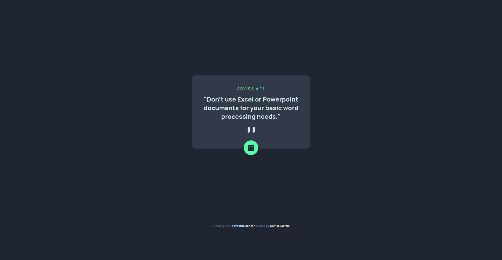

# Advice Generator App (Frontend Mentor)
## Challenge #006

## Welcome! 👋

This is a solution to the [Frontend Mentor](https://www.frontendmentor.io) This is my 6th  User Interface (UI) component challenge.

## Table of contents

- [The challenge](#the-challenge)
- [My process](#my-process)
  - [Built with](#built-with)
- [Author](#author)

## The challenge

Users should be able to:

- View the optimal layout for the app depending on their device's screen size
- See hover states for all interactive elements on the page
- Generate a new piece of advice by clicking the dice icon

## My process
### Built with

- Semantic HTML5
- CSS
- Vanilla JavaScript

## Author
### Sam B. Morris
- Codewars - [@divinestylus](www..com)
- Frontend Mentor - [@divinestylus](https://www.frontendmentor.io/profile/divinestylus)
- Twitter - [@divinestylus](https://www.twitter.com/divinestylus)